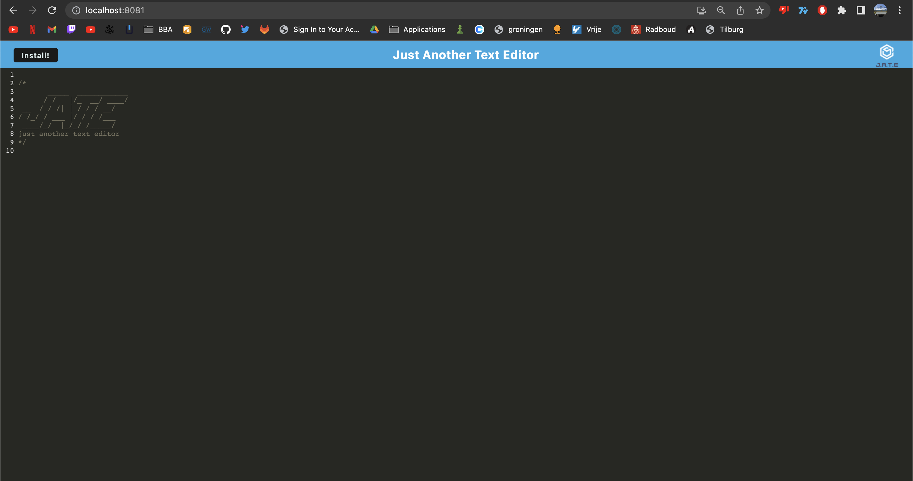
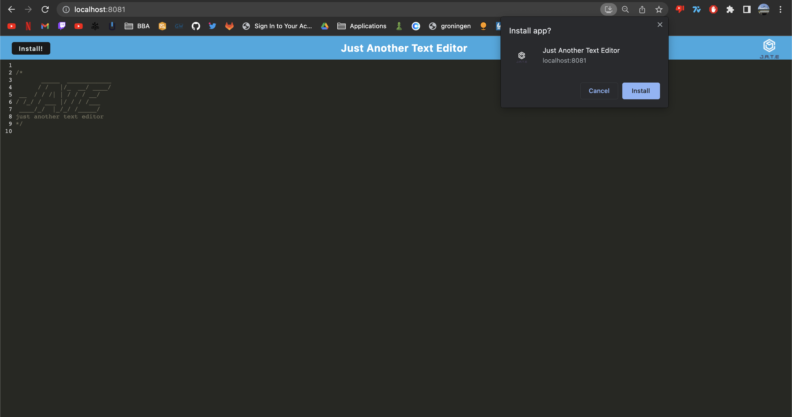
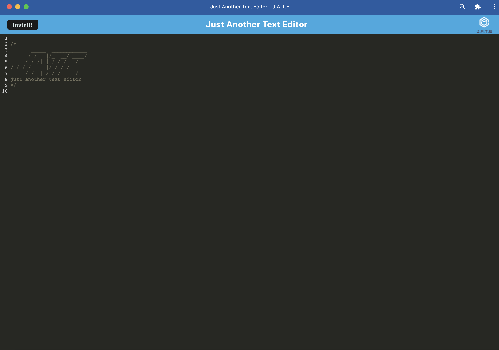

# TextEditorProgressiveWebApplication

## Description

The purpose of this project was to try and make a web application which can be downloaded and used offline. This was done using Service Workers, a Manifest.json file and webpack. The motivation behind this project was to understand caching and how web applications can be used offline which is a very important factor in nowadays web applications since certain individuals might be restricted to good internet. The application is a simple text editor but the focus was layed more on implementing the offline feature.

## Table of Contents (Optional)

- [Installation](#installation)
- [Usage](#usage)
- [Credits](#credits)
- [License](#license)

## Installation

If you wish to install this project you can either fork or clone the repository. After you have done so make sure to install all of the dependencies by opening the repository inside of your GitBash or Terminal and run the command, `npm run install` which is a script which will install the dependencies for all 3 package.json files since there is one inside the client, server and root folder. After doing this make sure to try `npm i` just to make sure that you also installed concurrently inside of your root folder.

Then run the command `npm run start:dev` which will minimize the javascript and html file and run a server on the port 3000. It is possible that your port might already be in use and if it is the case you should look for the port which webpack has alternatively chosen which is likely 8080 but given in the terminal. Here's an example URL: http://localhost:3000/

## Usage

If you wish to use the project you can use this deployed version: https://jatetest123.herokuapp.com/

If you wish to run the project inside of your local machine make sure to have followed all of the steps inside of the installation guidelines digilently.

Here is what the application should look like:

Here's what installing the application for offline capabilities would look like:

